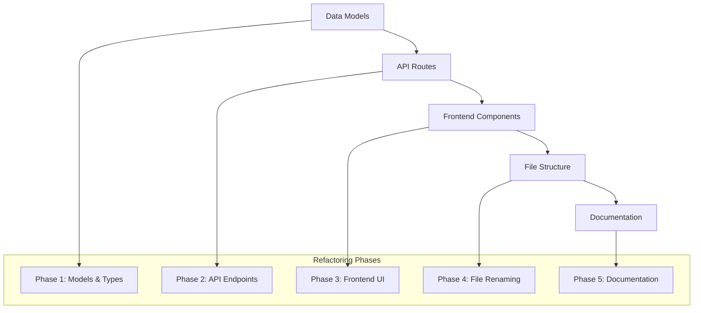

# Design Document

## Overview

The chapter-to-lesson refactoring is a comprehensive terminology update that affects multiple layers of the Google Drive courses system. This refactoring will systematically rename all "chapter" references to "lesson" while maintaining full functionality and ensuring zero downtime during the transition.

## Architecture

### Refactoring Strategy

The refactoring follows a systematic approach to ensure consistency and minimize breaking changes:



### Impact Analysis

The refactoring affects the following system components:

- **Data Models**: Chapter → Lesson, ChapterFile → LessonFile
- **API Routes**: `/chapters/` → `/lessons/`
- **Frontend Pages**: Chapter pages → Lesson pages
- **File Structure**: Directory and file names containing "chapter"
- **User Interface**: All user-facing text and navigation

## Components and Interfaces

### Data Model Changes

#### Current Chapter Interface → New Lesson Interface
```typescript
// Before (Chapter)
export interface Chapter {
  id: string;
  courseId: string;
  title: string;
  folderId: string;
  fileCount: number;
  lastUpdated: Date;
  order: number;
}

// After (Lesson)
export interface Lesson {
  id: string;
  courseId: string;
  title: string;
  folderId: string;
  fileCount: number;
  lastUpdated: Date;
  order: number;
}
```

#### Current ChapterFile Interface → New LessonFile Interface
```typescript
// Before (ChapterFile)
export interface ChapterFile {
  id: string;
  chapterId: string;
  name: string;
  mimeType: string;
  size: number;
  downloadUrl: string;
  viewUrl?: string;
  thumbnailUrl?: string;
  lastModified: Date;
}

// After (LessonFile)
export interface LessonFile {
  id: string;
  lessonId: string;
  name: string;
  mimeType: string;
  size: number;
  downloadUrl: string;
  viewUrl?: string;
  thumbnailUrl?: string;
  lastModified: Date;
}
```

### API Route Changes

#### Current API Structure → New API Structure
```
Before:
/api/courses/[courseId]/chapters/[chapterId]

After:
/api/courses/[courseId]/lessons/[lessonId]
```

#### API Response Structure Changes
```typescript
// Before
interface ChapterApiResponse {
  files: ChapterFile[];
  chapterName: string;
  chapterDescription?: string;
  totalFiles: number;
  cached: boolean;
}

// After
interface LessonApiResponse {
  files: LessonFile[];
  lessonName: string;
  lessonDescription?: string;
  totalFiles: number;
  cached: boolean;
}
```

### Frontend Component Changes

#### Page Route Changes
```
Before:
/courses/[courseId]/chapters/[chapterId]

After:
/courses/[courseId]/lessons/[lessonId]
```

#### Component File Renaming
```
Before:
- src/app/courses/[courseId]/chapters/[chapterId]/page.tsx

After:
- src/app/courses/[courseId]/lessons/[lessonId]/page.tsx
```

### File Structure Changes

#### Model Files
```
Before:
- src/lib/models/chapter.ts
- src/lib/models/chapter-file.ts

After:
- src/lib/models/lesson.ts
- src/lib/models/lesson-file.ts
```

#### API Route Files
```
Before:
- src/app/api/courses/[courseId]/chapters/[chapterId]/route.ts

After:
- src/app/api/courses/[courseId]/lessons/[lessonId]/route.ts
```

## Data Models

### Lesson Model (formerly Chapter)
```typescript
export interface Lesson {
  id: string;
  courseId: string;
  title: string;
  folderId: string;
  fileCount: number;
  lastUpdated: Date;
  order: number;
}

// Utility functions
export function transformDriveFolderToLesson(
  folder: drive_v3.Schema$File,
  courseId: string,
  fileCount: number = 0,
  order: number = 0
): Lesson;

export function sortLessonsByName(lessons: Lesson[]): Lesson[];
export function assignLessonOrder(lessons: Lesson[]): Lesson[];
export function generateLessonCacheKey(courseId: string, lessonId?: string, userId?: string): string;
```

### LessonFile Model (formerly ChapterFile)
```typescript
export interface LessonFile {
  id: string;
  lessonId: string;
  name: string;
  mimeType: string;
  size: number;
  downloadUrl: string;
  viewUrl?: string;
  thumbnailUrl?: string;
  lastModified: Date;
}

// Utility functions
export function transformDriveFileToLessonFile(
  file: drive_v3.Schema$File,
  lessonId: string
): LessonFile;

export function generateLessonFilesCacheKey(lessonId: string, userId?: string): string;
```

## Error Handling

### Backward Compatibility Strategy

During the transition period, the system will:

1. **Maintain API Compatibility**: Keep old chapter endpoints functional with redirects
2. **Handle Mixed References**: Support both old and new terminology in caching keys
3. **Graceful Degradation**: Ensure existing bookmarks and links continue to work

### Error Scenarios

- **Invalid Route Parameters**: Handle both `chapterId` and `lessonId` parameters
- **Cache Key Migration**: Gradually migrate cache keys from chapter to lesson format
- **Import Statement Updates**: Ensure all import statements are updated consistently

## Testing Strategy

### Unit Tests
- Test all renamed model interfaces and utility functions
- Verify data transformation functions work with new terminology
- Test cache key generation with new naming conventions

### Integration Tests
- Test API routes with new lesson endpoints
- Verify frontend components render correctly with lesson terminology
- Test navigation between courses and lessons

### Regression Tests
- Ensure existing functionality remains intact
- Test that all user workflows continue to work
- Verify that no broken links or references exist

### Migration Tests
- Test import statement updates
- Verify file renaming doesn't break functionality
- Test that all references are consistently updated

## Security Considerations

### Data Integrity
- Ensure all database references are updated consistently
- Maintain referential integrity during the terminology change
- Verify that user permissions and access controls remain intact

### API Security
- Update API route validation to use lesson terminology
- Ensure authentication and authorization work with new endpoints
- Maintain rate limiting and security headers

## Performance Considerations

### Caching Strategy
- Migrate existing cache keys from chapter to lesson format
- Implement cache warming for new lesson endpoints
- Ensure cache invalidation works with new terminology

### Bundle Size Impact
- Minimize impact on JavaScript bundle size during refactoring
- Ensure tree-shaking continues to work effectively
- Optimize import statements for better performance

## Migration Plan

### Phase 1: Data Models and Types
1. Create new lesson and lesson-file model files
2. Update TypeScript interfaces and utility functions
3. Update index.ts exports to include new models
4. Keep old models temporarily for backward compatibility

### Phase 2: API Endpoints
1. Create new lesson API routes alongside existing chapter routes
2. Update API response structures to use lesson terminology
3. Implement redirects from old chapter endpoints to new lesson endpoints
4. Update caching keys to use lesson terminology

### Phase 3: Frontend Components
1. Update all React components to use lesson terminology
2. Update page routes from chapters to lessons
3. Update navigation and breadcrumb components
4. Update all user-facing text and labels

### Phase 4: File Structure Refactoring
1. Rename model files from chapter to lesson
2. Rename API route directories and files
3. Rename frontend page directories and files
4. Update all import statements throughout the codebase

### Phase 5: Documentation and Cleanup
1. Update all code comments and JSDoc documentation
2. Update README files and technical documentation
3. Remove old chapter model files and deprecated code
4. Update error messages and logging statements

## Rollback Strategy

In case issues arise during the refactoring:

1. **Immediate Rollback**: Revert to previous commit if critical issues occur
2. **Partial Rollback**: Keep new models but revert UI changes if needed
3. **Gradual Migration**: Implement feature flags to control terminology display
4. **Monitoring**: Track error rates and user feedback during transition