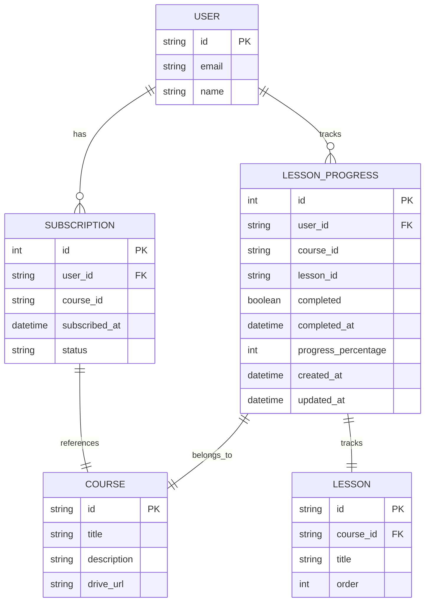

# Design Document

## Overview

The Course Subscription System extends the existing Google Drive-based course platform to include user subscriptions and lesson progress tracking. The system will use SQLite database tables to manage subscription relationships and track user progress through lessons, while maintaining the existing Google Drive integration for content delivery.

## Architecture

### High-Level Architecture

The system follows the existing Next.js architecture with these additions:

- **Database Layer**: New SQLite tables for subscriptions and lesson progress
- **Service Layer**: Subscription and progress management services
- **API Layer**: REST endpoints for subscription operations
- **UI Layer**: Enhanced course interfaces with subscription controls and progress indicators

### Integration Points

- **Authentication**: Leverages existing Better Auth system for user management
- **Course Data**: Integrates with existing Google Drive course fetching
- **Database**: Extends current SQLite database with new tables
- **UI Components**: Enhances existing course and lesson components

## Components and Interfaces

### Database Schema

#### Subscriptions Table
```sql
CREATE TABLE subscriptions (
  id INTEGER PRIMARY KEY AUTOINCREMENT,
  user_id TEXT NOT NULL,
  course_id TEXT NOT NULL,
  subscribed_at DATETIME DEFAULT CURRENT_TIMESTAMP,
  status TEXT DEFAULT 'active' CHECK (status IN ('active', 'cancelled')),
  UNIQUE(user_id, course_id),
  FOREIGN KEY (user_id) REFERENCES user (id) ON DELETE CASCADE
);
```

#### Lesson Progress Table
```sql
CREATE TABLE lesson_progress (
  id INTEGER PRIMARY KEY AUTOINCREMENT,
  user_id TEXT NOT NULL,
  course_id TEXT NOT NULL,
  lesson_id TEXT NOT NULL,
  completed BOOLEAN DEFAULT FALSE,
  completed_at DATETIME NULL,
  progress_percentage INTEGER DEFAULT 0 CHECK (progress_percentage >= 0 AND progress_percentage <= 100),
  created_at DATETIME DEFAULT CURRENT_TIMESTAMP,
  updated_at DATETIME DEFAULT CURRENT_TIMESTAMP,
  UNIQUE(user_id, course_id, lesson_id),
  FOREIGN KEY (user_id) REFERENCES user (id) ON DELETE CASCADE
);
```

### Data Models

#### Subscription Interface
```typescript
export interface Subscription {
  id: number;
  userId: string;
  courseId: string;
  subscribedAt: Date;
  status: 'active' | 'cancelled';
}
```

#### Lesson Progress Interface
```typescript
export interface LessonProgress {
  id: number;
  userId: string;
  courseId: string;
  lessonId: string;
  completed: boolean;
  completedAt: Date | null;
  progressPercentage: number;
  createdAt: Date;
  updatedAt: Date;
}
```

#### Enhanced Course Interface
```typescript
export interface CourseWithProgress extends Course {
  isSubscribed: boolean;
  completedLessons: number;
  progressPercentage: number;
}
```

#### Enhanced Lesson Interface
```typescript
export interface LessonWithProgress extends Lesson {
  completed: boolean;
  completedAt: Date | null;
  progressPercentage: number;
}
```

### Service Layer

#### SubscriptionService
```typescript
export class SubscriptionService {
  // Core subscription operations
  async subscribe(userId: string, courseId: string): Promise<Subscription>
  async unsubscribe(userId: string, courseId: string): Promise<void>
  async isSubscribed(userId: string, courseId: string): Promise<boolean>
  async getUserSubscriptions(userId: string): Promise<Subscription[]>
  
  // Progress tracking
  async markLessonComplete(userId: string, courseId: string, lessonId: string): Promise<void>
  async markLessonIncomplete(userId: string, courseId: string, lessonId: string): Promise<void>
  async getLessonProgress(userId: string, courseId: string, lessonId: string): Promise<LessonProgress | null>
  async getCourseProgress(userId: string, courseId: string): Promise<{ completed: number; total: number; percentage: number }>
  
  // Bulk operations
  async getCoursesWithProgress(userId: string, courseIds: string[]): Promise<CourseWithProgress[]>
  async getLessonsWithProgress(userId: string, courseId: string, lessons: Lesson[]): Promise<LessonWithProgress[]>
}
```

### API Endpoints

#### Subscription Management
- `POST /api/subscriptions` - Subscribe to a course
- `DELETE /api/subscriptions/[courseId]` - Unsubscribe from a course
- `GET /api/subscriptions` - Get user's subscriptions

#### Progress Tracking
- `POST /api/progress/[courseId]/lessons/[lessonId]/complete` - Mark lesson as complete
- `DELETE /api/progress/[courseId]/lessons/[lessonId]/complete` - Mark lesson as incomplete
- `GET /api/progress/[courseId]` - Get course progress summary

### UI Components

#### SubscriptionButton Component
```typescript
interface SubscriptionButtonProps {
  courseId: string;
  isSubscribed: boolean;
  onSubscriptionChange: (subscribed: boolean) => void;
}
```

#### ProgressIndicator Component
```typescript
interface ProgressIndicatorProps {
  completed: number;
  total: number;
  showPercentage?: boolean;
  size?: 'sm' | 'md' | 'lg';
}
```

#### LessonCompletionToggle Component
```typescript
interface LessonCompletionToggleProps {
  courseId: string;
  lessonId: string;
  completed: boolean;
  onToggle: (completed: boolean) => void;
}
```

## Data Models

### Database Relationships



### Data Flow

1. **Subscription Flow**:
   - User browses available courses
   - User clicks subscribe button
   - System creates subscription record
   - User gains access to course lessons

2. **Progress Tracking Flow**:
   - User accesses subscribed course lesson
   - User marks lesson as complete
   - System updates lesson_progress table
   - System recalculates course progress

3. **Access Control Flow**:
   - User attempts to access lesson
   - System checks subscription status
   - If subscribed: allow access and show progress
   - If not subscribed: redirect to subscription page

## Error Handling

### Subscription Errors
- **Duplicate Subscription**: Return existing subscription instead of error
- **Invalid Course ID**: Return 404 with clear error message
- **Unauthorized Access**: Redirect to authentication
- **Database Constraints**: Handle unique constraint violations gracefully

### Progress Tracking Errors
- **Lesson Not Found**: Return 404 with course context
- **No Subscription**: Return 403 with subscription prompt
- **Invalid Progress Data**: Validate percentage bounds (0-100)
- **Concurrent Updates**: Use database transactions for consistency

### Database Error Handling
```typescript
export class DatabaseError extends Error {
  constructor(
    message: string,
    public code: string,
    public constraint?: string
  ) {
    super(message);
    this.name = 'DatabaseError';
  }
}

export function handleDatabaseError(error: any): DatabaseError {
  if (error.code === 'SQLITE_CONSTRAINT_UNIQUE') {
    return new DatabaseError('Record already exists', 'DUPLICATE_ENTRY', error.constraint);
  }
  if (error.code === 'SQLITE_CONSTRAINT_FOREIGNKEY') {
    return new DatabaseError('Invalid reference', 'FOREIGN_KEY_VIOLATION', error.constraint);
  }
  return new DatabaseError('Database operation failed', 'UNKNOWN_ERROR');
}
```

## Testing Strategy

### Unit Tests
- **SubscriptionService**: Test all CRUD operations and business logic
- **Database Models**: Test data validation and constraints
- **Progress Calculations**: Test percentage calculations and edge cases
- **Error Handling**: Test all error scenarios and recovery

### Integration Tests
- **API Endpoints**: Test complete request/response cycles
- **Database Transactions**: Test concurrent access scenarios
- **Authentication Integration**: Test permission checks
- **Google Drive Integration**: Test with existing course data

### Component Tests
- **SubscriptionButton**: Test subscription state changes
- **ProgressIndicator**: Test visual progress representation
- **LessonCompletionToggle**: Test completion state management
- **Access Control**: Test subscription-based rendering

### Database Migration Tests
- **Schema Creation**: Test table creation and constraints
- **Data Integrity**: Test foreign key relationships
- **Index Performance**: Test query performance with indexes
- **Rollback Scenarios**: Test migration rollback procedures

### Performance Considerations

#### Database Optimization
- **Indexes**: Create indexes on frequently queried columns
  - `subscriptions(user_id, course_id)`
  - `lesson_progress(user_id, course_id)`
  - `lesson_progress(course_id, lesson_id)`

#### Caching Strategy
- **Course Progress**: Cache calculated progress percentages
- **Subscription Status**: Cache subscription checks for session duration
- **Lesson Lists**: Cache lesson data with progress annotations

#### Query Optimization
- **Batch Operations**: Fetch multiple course progress in single query
- **Lazy Loading**: Load progress data only when needed
- **Pagination**: Implement pagination for large subscription lists