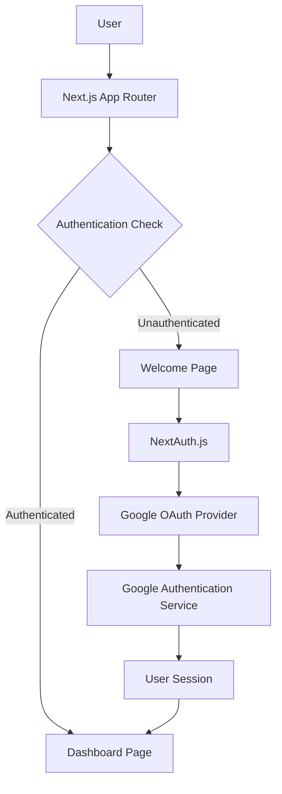
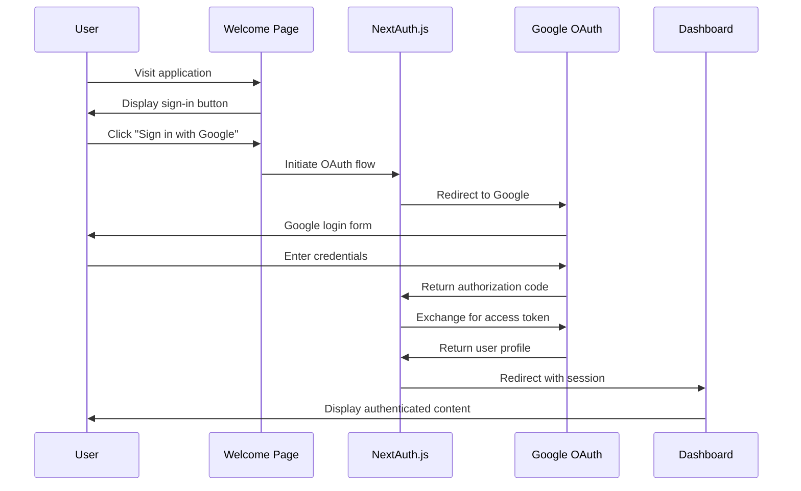

# Design Document: Google Authentication Feature

## Overview

This design implements Google OAuth authentication for a Next.js 16 application using NextAuth.js v5 (Auth.js). The system provides a seamless authentication flow with a welcome page for unauthenticated users and a protected dashboard for authenticated users. The architecture leverages Next.js App Router, server components, and modern React patterns.

## Architecture

### High-Level Architecture



### Authentication Flow



## Components and Interfaces

### Core Components

#### 1. Authentication Provider (`AuthProvider`)
- **Purpose**: Wraps the application with NextAuth.js session provider
- **Location**: `src/components/providers/AuthProvider.tsx`
- **Responsibilities**:
  - Provide session context to all components
  - Handle session state management
  - Enable client-side session access

#### 2. Welcome Page (`WelcomePage`)
- **Purpose**: Landing page for unauthenticated users
- **Location**: `src/app/page.tsx`
- **Responsibilities**:
  - Display application introduction
  - Provide Google sign-in button
  - Handle authentication initiation
  - Show authentication errors if any

#### 3. Dashboard Page (`DashboardPage`)
- **Purpose**: Protected page for authenticated users
- **Location**: `src/app/dashboard/page.tsx`
- **Responsibilities**:
  - Display user profile information
  - Provide sign-out functionality
  - Show authenticated user content
  - Redirect unauthenticated users

#### 4. Sign-In Button (`SignInButton`)
- **Purpose**: Reusable Google sign-in component
- **Location**: `src/components/auth/SignInButton.tsx`
- **Responsibilities**:
  - Trigger Google OAuth flow
  - Display loading states
  - Handle authentication errors

#### 5. Sign-Out Button (`SignOutButton`)
- **Purpose**: Reusable sign-out component
- **Location**: `src/components/auth/SignOutButton.tsx`
- **Responsibilities**:
  - Terminate user session
  - Redirect to welcome page
  - Clear authentication state

### API Routes

#### 1. NextAuth.js API Route
- **Location**: `src/app/api/auth/[...nextauth]/route.ts`
- **Purpose**: Handle all authentication endpoints
- **Endpoints**:
  - `/api/auth/signin` - Initiate sign-in
  - `/api/auth/signout` - Handle sign-out
  - `/api/auth/callback/google` - Google OAuth callback
  - `/api/auth/session` - Get current session

### Configuration Files

#### 1. NextAuth Configuration
- **Location**: `src/lib/auth.ts`
- **Purpose**: Configure authentication providers and options
- **Configuration**:
  - Google OAuth provider setup
  - Session strategy configuration
  - Callback URL definitions
  - JWT and session settings

#### 2. Environment Configuration
- **Location**: `.env.local`
- **Required Variables**:
  - `NEXTAUTH_URL` - Application base URL
  - `NEXTAUTH_SECRET` - JWT signing secret
  - `GOOGLE_CLIENT_ID` - Google OAuth client ID
  - `GOOGLE_CLIENT_SECRET` - Google OAuth client secret

## Data Models

### User Session Interface
```typescript
interface User {
  id: string;
  name?: string | null;
  email?: string | null;
  image?: string | null;
}

interface Session {
  user: User;
  expires: string;
}
```

### Authentication State
```typescript
interface AuthState {
  status: 'loading' | 'authenticated' | 'unauthenticated';
  data: Session | null;
}
```

## Error Handling

### Authentication Errors
1. **OAuth Errors**: Display user-friendly messages for Google OAuth failures
2. **Network Errors**: Handle connectivity issues with retry mechanisms
3. **Configuration Errors**: Validate environment variables and provide clear error messages
4. **Session Errors**: Handle expired or invalid sessions gracefully

### Error Boundaries
- Implement error boundaries around authentication components
- Provide fallback UI for authentication failures
- Log errors for debugging while maintaining user privacy

### Error States
- Loading states during authentication flow
- Error messages for failed authentication attempts
- Graceful degradation when authentication services are unavailable

## Testing Strategy

### Unit Tests
- Test authentication utility functions
- Test component rendering with different auth states
- Test error handling scenarios
- Mock NextAuth.js for isolated testing

### Integration Tests
- Test complete authentication flow
- Test protected route access
- Test session persistence across page refreshes
- Test sign-out functionality

### End-to-End Tests
- Test Google OAuth flow (using test accounts)
- Test navigation between authenticated and unauthenticated states
- Test error scenarios and recovery

## Security Considerations

### OAuth Security
- Use PKCE (Proof Key for Code Exchange) for OAuth flow
- Validate OAuth state parameter to prevent CSRF attacks
- Secure storage of OAuth tokens
- Proper token expiration handling

### Session Security
- Use secure, HTTP-only cookies for session storage
- Implement proper CSRF protection
- Use strong JWT signing secrets
- Regular session token rotation

### Environment Security
- Secure storage of OAuth client secrets
- Proper environment variable management
- Separate development and production OAuth applications

## Performance Considerations

### Client-Side Performance
- Lazy load authentication components
- Minimize bundle size with tree shaking
- Use React.memo for authentication components
- Optimize re-renders with proper dependency arrays

### Server-Side Performance
- Use Next.js middleware for route protection
- Implement efficient session validation
- Cache authentication state appropriately
- Minimize API calls for session checks

## Implementation Notes

### Next.js App Router Integration
- Use server components where possible for better performance
- Implement proper client/server component boundaries
- Leverage Next.js middleware for route protection
- Use proper TypeScript types for enhanced developer experience

### Styling and UI
- Use existing Tailwind CSS setup for consistent styling
- Implement responsive design for mobile compatibility
- Follow accessibility best practices for authentication UI
- Maintain consistency with existing application design

### Future Extensibility
- Design authentication system to support additional OAuth providers
- Structure code to easily add Google Drive API integration
- Implement proper separation of concerns for maintainability
- Use TypeScript for better code documentation and safety