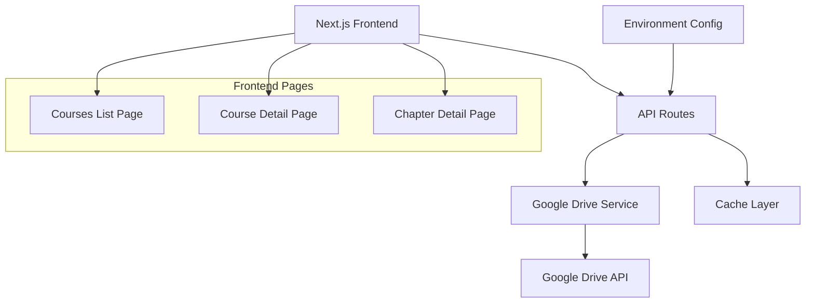

# Design Document

## Overview

The Google Drive Courses system is a Next.js web application that provides a hierarchical view of educational content stored in Google Drive. The system reads course URLs from environment variables, uses the Google Drive API to fetch folder structures, and presents a three-tier navigation: Courses → Chapters → Files.

## Architecture

### High-Level Architecture



### Technology Stack

- **Frontend**: Next.js 14+ with React Server Components
- **API Integration**: Google Drive API v3
- **Authentication**: Better Auth with Google OAuth 2.0 (user authentication)
- **Caching**: Next.js built-in caching + Redis (optional)
- **Styling**: Tailwind CSS
- **State Management**: React Server Components + client-side state for UI interactions

## Components and Interfaces

### Core Services

#### GoogleDriveService
```typescript
interface GoogleDriveService {
  listFolders(folderId: string, accessToken: string): Promise<DriveFolder[]>
  listFiles(folderId: string, accessToken: string): Promise<DriveFile[]>
  getFolderMetadata(folderId: string, accessToken: string): Promise<FolderMetadata>
  getFileDownloadUrl(fileId: string, accessToken: string): Promise<string>
}
```

#### CourseService
```typescript
interface CourseService {
  getAllCourses(): Promise<Course[]>
  getCourseById(courseId: string): Promise<Course>
  getChaptersByCourse(courseId: string): Promise<Chapter[]>
  getFilesByChapter(chapterId: string): Promise<ChapterFile[]>
}
```

### API Routes

#### `/api/courses`
- GET: Returns list of all courses from COURSES_LIST
- Caches results for 1 hour

#### `/api/courses/[courseId]`
- GET: Returns course details and chapters
- Caches results for 30 minutes

#### `/api/courses/[courseId]/chapters/[chapterId]`
- GET: Returns chapter details and files
- Caches results for 15 minutes

### Frontend Components

#### CoursesListPage
- Displays grid of available courses
- Shows course titles, descriptions, and chapter counts
- Handles loading states and error messages

#### CourseDetailPage
- Shows course information and chapter list
- Implements breadcrumb navigation
- Displays chapter metadata (file count, last updated)

#### ChapterDetailPage
- Lists all files in the chapter
- Provides file preview and download links
- Shows file metadata (size, type, modified date)

## Data Models

### Course
```typescript
interface Course {
  id: string
  title: string
  description?: string
  driveUrl: string
  folderId: string
  chapterCount: number
  lastUpdated: Date
  thumbnailUrl?: string
}
```

### Chapter
```typescript
interface Chapter {
  id: string
  courseId: string
  title: string
  folderId: string
  fileCount: number
  lastUpdated: Date
  order: number
}
```

### ChapterFile
```typescript
interface ChapterFile {
  id: string
  chapterId: string
  name: string
  mimeType: string
  size: number
  downloadUrl: string
  viewUrl?: string
  thumbnailUrl?: string
  lastModified: Date
}
```

### Configuration
```typescript
interface CourseConfig {
  coursesListEnv: string
  cacheSettings: {
    courseTtl: number
    chapterTtl: number
    fileTtl: number
  }
}

interface UserSession {
  user: {
    id: string
    email: string
    name: string
  }
  accessToken: string
  refreshToken: string
}
```

## Error Handling

### API Error Responses
- **401 Unauthorized**: Google Drive authentication failed
- **403 Forbidden**: Insufficient permissions for folder access
- **404 Not Found**: Course, chapter, or file not found
- **429 Rate Limited**: Google Drive API quota exceeded
- **500 Internal Error**: Server-side processing errors

### Frontend Error Handling
- Display user-friendly error messages for each error type
- Implement retry mechanisms for transient failures
- Show fallback content when courses are unavailable
- Log errors for debugging while hiding technical details from users

### Graceful Degradation
- Show cached content when API is unavailable
- Display partial course lists if some URLs fail
- Allow access to previously loaded chapters during network issues

## Testing Strategy

### Unit Tests
- Google Drive service methods
- Course data transformation logic
- URL parsing and validation
- Cache key generation

### Integration Tests
- API route handlers with mocked Google Drive responses
- End-to-end course navigation flow
- Authentication and authorization flows

### Performance Tests
- API response times under load
- Cache effectiveness measurements
- Google Drive API rate limit handling

### User Acceptance Tests
- Course browsing workflows
- File access and download functionality
- Error scenario handling
- Mobile responsiveness

## Security Considerations

### Authentication & Authorization
- Use logged-in user's Google OAuth token for Drive API access
- Leverage existing Better Auth Google integration with drive.file scope
- Validate user session before processing any Drive requests
- Respect user's Google Drive permissions for folder access
- Validate all Google Drive URLs before processing

### Data Protection
- Cache only non-sensitive metadata
- Implement proper session management
- Use HTTPS for all external API calls
- Sanitize file names and descriptions for XSS prevention

### Rate Limiting
- Implement client-side request throttling
- Use exponential backoff for failed requests
- Monitor Google Drive API quota usage
- Implement circuit breaker pattern for API failures