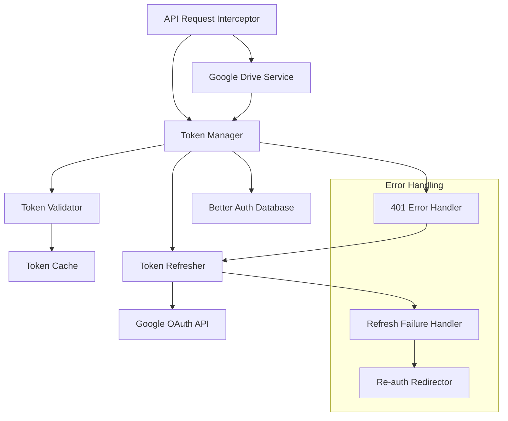

# Design Document

## Overview

The Google OAuth Token Refresh system provides automatic token lifecycle management for maintaining persistent access to Google Drive APIs. The system integrates seamlessly with the existing Better Auth implementation and Google Drive service, implementing proactive token refresh, error recovery, and transparent retry mechanisms to ensure uninterrupted API access.

## Architecture

### High-Level Architecture



### Integration Points

- **Better Auth Database**: Stores and retrieves OAuth tokens
- **Google Drive Service**: Consumes refreshed tokens transparently
- **Google OAuth API**: Handles token refresh operations
- **Next.js Session Management**: Maintains user session continuity

## Components and Interfaces

### Core Services

#### TokenManager
```typescript
interface TokenManager {
  getValidAccessToken(userId: string): Promise<string>
  refreshTokenIfNeeded(userId: string): Promise<boolean>
  handleApiError(error: any, userId: string): Promise<string>
  clearInvalidTokens(userId: string): Promise<void>
}
```

#### TokenValidator
```typescript
interface TokenValidator {
  isTokenExpired(token: string): boolean
  isTokenExpiringSoon(token: string, bufferMinutes?: number): boolean
  validateTokenFormat(token: string): boolean
  getTokenExpiry(token: string): Date | null
}
```

#### TokenRefresher
```typescript
interface TokenRefresher {
  refreshAccessToken(refreshToken: string): Promise<RefreshResult>
  updateStoredTokens(userId: string, tokens: TokenPair): Promise<void>
  validateRefreshToken(refreshToken: string): boolean
}
```

#### ApiRequestInterceptor
```typescript
interface ApiRequestInterceptor {
  interceptRequest(request: DriveApiRequest): Promise<DriveApiResponse>
  retryWithNewToken(request: DriveApiRequest, newToken: string): Promise<DriveApiResponse>
  handleAuthenticationError(error: any, userId: string): Promise<string>
}
```

### Enhanced GoogleDriveService

The existing GoogleDriveService will be enhanced with automatic token management:

```typescript
class GoogleDriveService {
  private tokenManager: TokenManager;
  
  constructor(userId: string) {
    this.tokenManager = new TokenManager();
    // Initialize with user ID instead of access token
  }
  
  async listFolders(folderId: string): Promise<DriveFolder[]> {
    const accessToken = await this.tokenManager.getValidAccessToken(this.userId);
    // Existing implementation with automatic retry on 401
  }
}
```

### Enhanced getUserSession Function

```typescript
async function getUserSession(): Promise<UserSession | null> {
  const session = await auth.api.getSession({ headers: await headers() });
  
  if (!session?.user) return null;
  
  const tokenManager = new TokenManager();
  const accessToken = await tokenManager.getValidAccessToken(session.user.id);
  
  return {
    user: session.user,
    accessToken,
    refreshToken: await getRefreshToken(session.user.id)
  };
}
```

## Data Models

### TokenPair
```typescript
interface TokenPair {
  accessToken: string;
  refreshToken: string;
  expiresAt: Date;
  tokenType: 'Bearer';
}
```

### RefreshResult
```typescript
interface RefreshResult {
  success: boolean;
  accessToken?: string;
  expiresIn?: number;
  error?: string;
  requiresReauth?: boolean;
}
```

### TokenCacheEntry
```typescript
interface TokenCacheEntry {
  userId: string;
  accessToken: string;
  expiresAt: Date;
  lastValidated: Date;
}
```

### DriveApiRequest
```typescript
interface DriveApiRequest {
  method: 'GET' | 'POST' | 'PUT' | 'DELETE';
  url: string;
  headers: Record<string, string>;
  body?: any;
  retryCount: number;
}
```

## Implementation Details

### Token Validation Logic

```typescript
class TokenValidator {
  isTokenExpired(token: string): boolean {
    try {
      const payload = this.decodeJWT(token);
      return Date.now() >= payload.exp * 1000;
    } catch {
      return true; // Invalid token format
    }
  }
  
  isTokenExpiringSoon(token: string, bufferMinutes = 5): boolean {
    try {
      const payload = this.decodeJWT(token);
      const expiryTime = payload.exp * 1000;
      const bufferTime = bufferMinutes * 60 * 1000;
      return Date.now() >= (expiryTime - bufferTime);
    } catch {
      return true;
    }
  }
}
```

### Token Refresh Implementation

```typescript
class TokenRefresher {
  async refreshAccessToken(refreshToken: string): Promise<RefreshResult> {
    try {
      const response = await fetch('https://oauth2.googleapis.com/token', {
        method: 'POST',
        headers: { 'Content-Type': 'application/x-www-form-urlencoded' },
        body: new URLSearchParams({
          client_id: process.env.GOOGLE_CLIENT_ID!,
          client_secret: process.env.GOOGLE_CLIENT_SECRET!,
          refresh_token: refreshToken,
          grant_type: 'refresh_token'
        })
      });
      
      if (!response.ok) {
        const error = await response.json();
        return {
          success: false,
          error: error.error_description,
          requiresReauth: error.error === 'invalid_grant'
        };
      }
      
      const data = await response.json();
      return {
        success: true,
        accessToken: data.access_token,
        expiresIn: data.expires_in
      };
    } catch (error) {
      return {
        success: false,
        error: 'Network error during token refresh'
      };
    }
  }
}
```

### API Request Interception

```typescript
class ApiRequestInterceptor {
  async interceptRequest(request: DriveApiRequest): Promise<DriveApiResponse> {
    try {
      const response = await this.executeRequest(request);
      return response;
    } catch (error) {
      if (error.status === 401 && request.retryCount === 0) {
        const newToken = await this.handleAuthenticationError(error, request.userId);
        request.headers.Authorization = `Bearer ${newToken}`;
        request.retryCount = 1;
        return this.executeRequest(request);
      }
      throw error;
    }
  }
}
```

### Database Integration

The system will extend the existing Better Auth database schema:

```sql
-- Better Auth already has this table, we'll use it as-is
CREATE TABLE account (
  id TEXT PRIMARY KEY,
  userId TEXT NOT NULL,
  providerId TEXT NOT NULL,
  accessToken TEXT,
  refreshToken TEXT,
  expiresAt INTEGER,
  createdAt INTEGER NOT NULL,
  updatedAt INTEGER NOT NULL
);

-- Optional: Add index for faster token lookups
CREATE INDEX IF NOT EXISTS idx_account_user_provider 
ON account(userId, providerId);
```

## Error Handling

### Token Refresh Errors

1. **Invalid Refresh Token**: Clear stored tokens, redirect to re-authentication
2. **Network Errors**: Retry with exponential backoff (max 3 attempts)
3. **Rate Limiting**: Implement backoff strategy with jitter
4. **Server Errors**: Log error, attempt retry after delay

### API Request Errors

1. **401 Unauthorized**: Attempt token refresh once, then fail
2. **403 Forbidden**: Pass through (permissions issue, not token)
3. **429 Rate Limited**: Implement exponential backoff
4. **Network Errors**: Retry with fresh token

### Fallback Strategies

```typescript
class ErrorHandler {
  async handleRefreshFailure(userId: string, error: any): Promise<void> {
    // Log the error for debugging
    console.error('Token refresh failed:', error);
    
    // Clear invalid tokens
    await this.clearStoredTokens(userId);
    
    // Redirect to re-authentication
    redirect('/api/auth/signin/google');
  }
  
  async handleNetworkError(request: DriveApiRequest): Promise<DriveApiResponse> {
    const maxRetries = 3;
    let delay = 1000; // Start with 1 second
    
    for (let i = 0; i < maxRetries; i++) {
      try {
        await new Promise(resolve => setTimeout(resolve, delay));
        return await this.executeRequest(request);
      } catch (error) {
        delay *= 2; // Exponential backoff
        if (i === maxRetries - 1) throw error;
      }
    }
  }
}
```

## Testing Strategy

### Unit Tests

1. **TokenValidator Tests**
   - Token expiry detection with various JWT formats
   - Edge cases: malformed tokens, missing exp claims
   - Buffer time calculations for proactive refresh

2. **TokenRefresher Tests**
   - Successful token refresh scenarios
   - Invalid refresh token handling
   - Network error scenarios
   - Google OAuth API error responses

3. **ApiRequestInterceptor Tests**
   - 401 error detection and retry logic
   - Single retry limitation
   - Token injection into retry requests

### Integration Tests

1. **End-to-End Token Flow**
   - Complete token refresh cycle with database updates
   - API request retry with refreshed token
   - Error handling with invalid refresh tokens

2. **Database Integration**
   - Token storage and retrieval from Better Auth database
   - Concurrent token refresh handling
   - Token cleanup operations

### Performance Tests

1. **Token Cache Performance**
   - Cache hit/miss ratios
   - Memory usage with multiple users
   - Cache invalidation timing

2. **Refresh Operation Timing**
   - Token refresh latency measurements
   - Database update performance
   - Concurrent refresh handling

## Security Considerations

### Token Storage Security

- Refresh tokens stored encrypted in Better Auth database
- Access tokens cached in memory with automatic expiry
- No token logging in production environments
- Secure token transmission over HTTPS only

### Refresh Token Protection

- Validate refresh token format before use
- Implement refresh token rotation when supported
- Clear tokens immediately on logout
- Monitor for suspicious refresh patterns

### Rate Limiting Protection

- Implement client-side refresh throttling
- Prevent refresh token abuse
- Monitor refresh frequency per user
- Implement circuit breaker for repeated failures

### Error Information Disclosure

- Generic error messages to users
- Detailed logging for developers only
- No token values in error messages
- Sanitized error responses from Google OAuth API